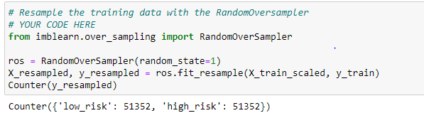

## Overview

We use Machine Learning techniques in this analysis to evaluate credit risk. This analysis uses Supervised Learning using a dataset from a lending service company for this exercise. Different techniques are used to train and revaluate models with unbalanced classes. Imbalanced-learn and scikit-learn libraries are used to build and evaluate models using resampling techniques.

The models include Logistic Regression, EasyEnsemble and Balanced Random Forest

Resampling Techniques used include Oversampling - SMOTE, Undersampling - Cluster Centroids and SMOTEENN

## Results 

**Results:** Using bulleted lists, describe the balanced accuracy scores and the precision and recall scores of all six machine learning models. Use screenshots of your outputs to support your results.

**Ranking of models in descending order based on "High Risk" results:**

- `EasyEnsembleClassifer`: 93.2% accuracy, 9% precision, 94% recall, and 16% F1 Score
- `SMOTEENN`:79.7% accuracy, 3% precision, 72% recall and 5% F1 Score
- `SMOTE`: 79.7% accuracy,3% precision, 71% recall and 6% F1 Score
- `BalancedRandomForestClassifer`: 78.9% accuracy, 3% precision, 70% recall and 6% F1 Score
- `RandomOverSampler`: 78.8.0% accuracy, 3% precision, 70% recall and 5% F1 Score
- `ClusterCentroids`: 77.4% accuracy, 2% precision, 78% recall and .03% F1 Score

The Easy Ensemble AdaBoost classifier had the best balanced accuracy score at 93% v/s the SMOTEENN at 79.7%
The  Easy Ensemble classifier had the best recall score at 94% v/s 78% for the clusterCentroids. classifier
The  Easy Ensemble classifier had the best geometric mean score at 93% v/s 78% for the geometric mean.

- | **Initial Data Set**                               |      |      |      |
  | -------------------------------------------------- | ---- | ---- | ---- |
  |                             |      |      |      |
  |                             |      |      |      |
  |                             |      |      |      |
  | **Naïve  Random Oversampling**                     |      |      |      |
  |                                                    |      |      |      |
  |                             |      |      |      |
  | **SMOTE Oversamplng**                              |      |      |      |
  |         |      |      |      |
  |                                                    |      |      |      |
  |                                                    |      |      |      |
  | **Undersampling  - Cluster Centroids**             |      |      |      |
  |                             |      |      |      |
  | **Combination (Over and Under  Sampling) SMOTEEN** |      |      |      |
  |                             |      |      |      |

|                                        |
| -------------------------------------- |
|                                        |
| **Easy Ensemble AdaBoost  Classified** |
|                |

 

| **Balanced Random Forest  Classifier** |
| -------------------------------------- |
|                |

## Summary

Based on the results of all the six models the EasyEnsembleClassifier model yielded the best results with an accuracy of 93.2%, and a precision rate of 9%. The sensitivity (or recall ) rate was the highest at 94%. Prediction for the Low Risk" was also the highest with the sensitivity at 94% and the F1 score at 97%. 
 Recommendation - The EasyEnsembleClassifier model ranks as the best model suited for this type of analysis . 

- 
